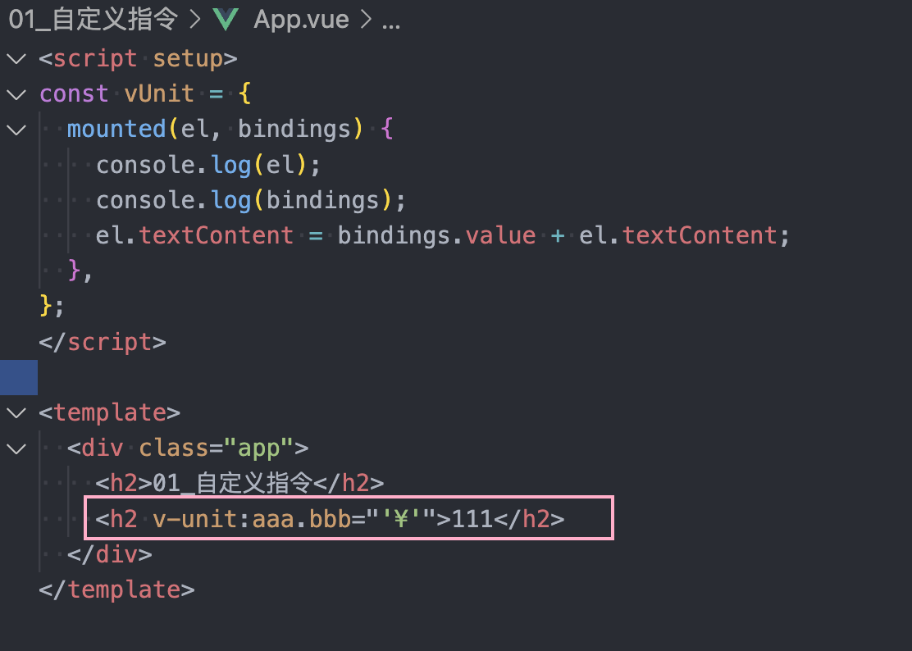
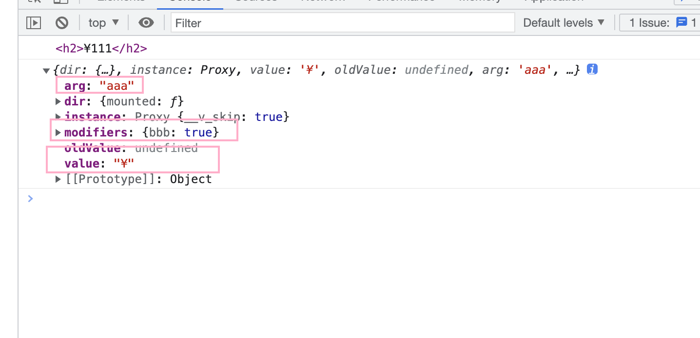

# 10_learn-advance

## 01_自定义指令

### 基本使用

- Options api

```js
export default {
  directives: {
    focus: {
      mounted(el) {
        console.log(el);
        el.focus();
      },
    },
  },
};
```

- Composition api

```js
const vFocus = {
  mounted(el) {
    console.log(el, "----");
    el.focus();
  },
};
```

### 生命周期

- created
- beforeMount
- mounted
- beforeUpdate
- updated
- beforeUnmount
- unmounted

### 指令的参数、修饰符、具体值





### 全局指令

```js
app.directives("fTime", {
  mounted(el) {
    console.log(el)
  }
})
```

## 02_其它内置组件

- teleport
- suspence

## 03_安装插件

- 函数 `function(app) {}`
- 对象 `{install(app) {}}`

## 04_Render函数

## 05_JSX语法

- Vue/cli
  - https://github.com/vuejs/babel-plugin-jsx
- vite
  - https://github.com/vitejs/vite/tree/main/packages/plugin-vue-jsx#readme

## 06_过渡动画

- transition
  - v-enter-from
  - v-enter-actiove
  - v-enter-to
  - v-leave-from
  - v-leave-avtive
  - v-leave-to
- transition-group